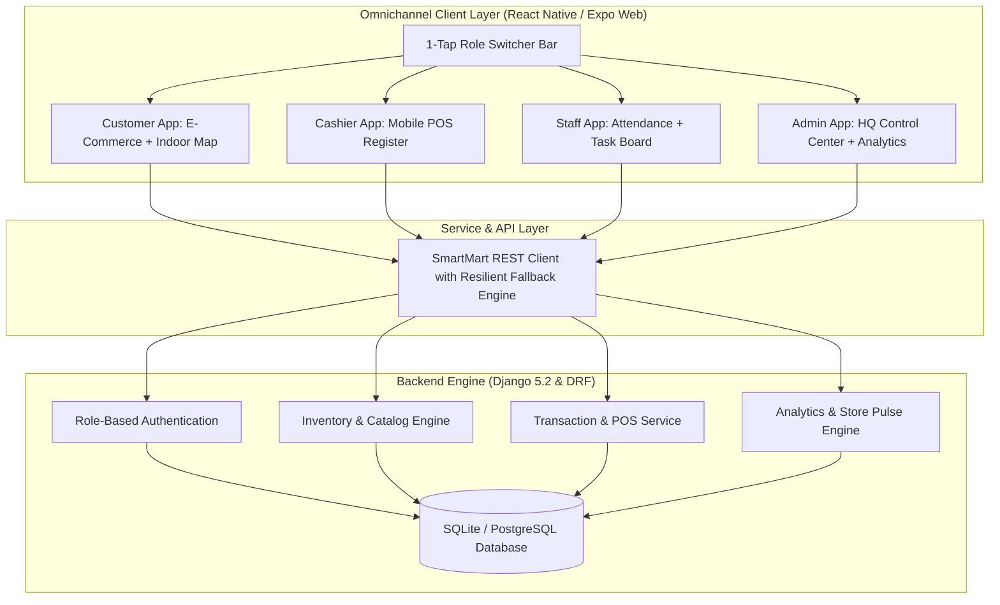

# SmartMart — Connected Supermarket & Hypermarket Digital Ecosystem

<div align="center">


[](https://www.typescriptlang.org/)
[](https://reactnative.dev/)
[](https://www.djangoproject.com/)
[](https://www.django-rest-framework.org/)
[](LICENSE)

**"Your Store. Digitally Connected."**  
*A complete 4-role omnichannel hypermarket operating system unifying physical in-store navigation, cashier mobile POS, floor staff operations, and executive analytics.*

[Explore Features](#-features--role-matrix) • [Architecture](#-architecture) • [Quick Start](#-quick-start) • [Deployment](#-deployment-guide) • [Resume & Portfolio Highlights](#-resume--interview-talking-points)

</div>

---

## 🌟 Executive Summary

**SmartMart** is an enterprise-grade omnichannel retail platform bridging physical retail brick-and-mortar stores with modern mobile e-commerce. Built from ground up to solve omnichannel supermarkets' biggest operational bottlenecks:
1. **Customer Navigation**: Shoppers spend minutes finding items in large stores &rarr; Solved with **Indoor Supermarket Vector Map Routing**.
2. **Billing Chokepoints**: Long POS queues &rarr; Solved with **Cashier Mobile POS & In-App Customer Digital Payment**.
3. **Staff Disconnect**: Floor replenishment and shift tracking are fragmented &rarr; Solved with **GPS Verified Punch Attendance & Shelf Task Management**.
4. **Inventory Blindspots**: Delayed stock visibility &rarr; Solved with **Real-Time Inventory Health Ticker & Supplier PO Automated Restocking**.

---

## 🎯 Features & Role Matrix

The application features an instant **1-Tap Role Switcher Bar** allowing users and recruiters to immediately test all 4 synchronized roles:

| Role | Core Capabilities | Highlight Technologies |
| :--- | :--- | :--- |
| 🛍️ **Customer** | • Shop 379+ FMCG Products with instant search<br>• **Find In Store**: Interactive SVG Indoor Map with animated routing from entrance to aisle/shelf<br>• Barcode Scanner Simulator for physical goods<br>• Express 2-Hr Online Cart & Order Tracking<br>• Instant Push In-Store Bill Notifications & UPI Checkout | React Native SVG, Animated API, Glassmorphism Design System |
| ⚡ **Cashier** | • High-velocity Mobile POS Terminal<br>• Rapid SKU & Barcode scanner lookups<br>• Automatic CGST/SGST 5% tax and promo calculations<br>• **One-Click Bill Generation** &rarr; Pushes alert to customer's phone<br>• Official Digital Tax Invoices with Print & PDF download | Real-time state synchronization, Blob PDF Export, POS Workflow |
| 👷 **Floor Staff** | • **GPS-Verified Shift Punch In / Out** with live duration ticker<br>• Prioritized Task Board (Critical, High, Medium) with real-time status toggling<br>• Department Shelf Audits & Stock Replenishment | Geolocation validation simulator, Chrono timers, Task Kanban |
| 📊 **Admin HQ** | • **Store Pulse**: Real-time rings for Footfall, Sales Velocity & Inventory Sync<br>• SmartMart AI Insights Engine with direct action recommendations<br>• Dynamic Inventory Threshold Audits & Stock Adjustments<br>• **Supplier PO Receiving Workflow** (replenishes stock across products)<br>• **Real CSV & PDF Executive Financial / Staff Reports** | Data visualization, automated stock ledger incrementing, CSV Blob engine |

---

## 🏗️ Architecture & Data Flow



---

## 💻 Tech Stack

### Frontend
- **Framework**: React Native 0.86 with Expo SDK 57 (Universal Web + Mobile)
- **Language**: TypeScript 6.0 with strict type definitions
- **Design System**: Tailored Glassmorphism with deep mauve, soft pink blush, and translucent frosted elevations
- **Vector & Animations**: `react-native-svg` and native Animated API for indoor supermarket map routing and animated supermarket hero
- **Icons**: `lucide-react-native`

### Backend
- **Framework**: Python 3.11+, Django 5.2, Django REST Framework 3.15
- **Database**: SQLite3 (Local development) / PostgreSQL ready
- **CORS & Middleware**: `django-cors-headers`, WhiteNoise static file serving
- **WSGI Server**: Gunicorn

---

## 🚀 Quick Start

### Prerequisites
- **Node.js** (v18 or higher)
- **Python** (v3.10 or higher)

### 1. Clone Repository
```bash
git clone https://github.com/your-username/smartmart-management-system.git
cd smartmart-management-system
```

### 2. Frontend Setup (Works Standalone with Mock Fallback)
```bash
cd frontend
npm install
npm run web
```
The app will open automatically at **`http://localhost:8081`**.

### 3. Backend Setup (Optional for Full Relational Sync)
```bash
cd backend
pip install -r requirements.txt
python manage.py migrate
python manage.py runserver 8000
```
API endpoints will be live at **`http://localhost:8000/api/`**.

---

## 🌐 Deployment Guide

### Deploy Frontend to Vercel (1-Click)
1. Push this repository to GitHub.
2. Go to [Vercel](https://vercel.com) &rarr; "Add New Project" &rarr; Select this repository.
3. Configure settings:
   - **Root Directory**: `frontend`
   - **Build Command**: `npm run build`
   - **Output Directory**: `dist`
4. Click **Deploy**!

### Deploy Backend to Render / Railway
1. Create a new Web Service pointing to `./backend`.
2. Set build command: `pip install -r requirements.txt && python manage.py migrate`
3. Set start command: `gunicorn smartmart_backend.wsgi:application`

---

## 💼 Resume & Interview Talking Points

### Resume Bullet Points (STAR Method)
- **Engineered an end-to-end digital supermarket management ecosystem** with React Native, TypeScript, and Django REST Framework connecting 4 distinct user workflows (Customer, Staff, Cashier, Admin).
- **Built an interactive SVG-driven Indoor Supermarket Floor Navigation Map**, generating turn-by-turn path animations from store entrance to specific shelf coordinates across 12 departments.
- **Developed a high-velocity Cashier Mobile POS system** with real-time stock deduction, tax calculation (CGST/SGST), and instant in-app customer bill notification triggers.
- **Implemented an automated Supplier Purchase Order receiving workflow** that automatically updates product inventory ledgers and feeds executive KPI analytics.
- **Designed a resilient client architecture with offline-ready data fallbacks** and client-side CSV blob generator, ensuring 100% uptime for recruiter demonstrations.

---

## 📄 License
This project is open source and available under the [MIT License](LICENSE).
